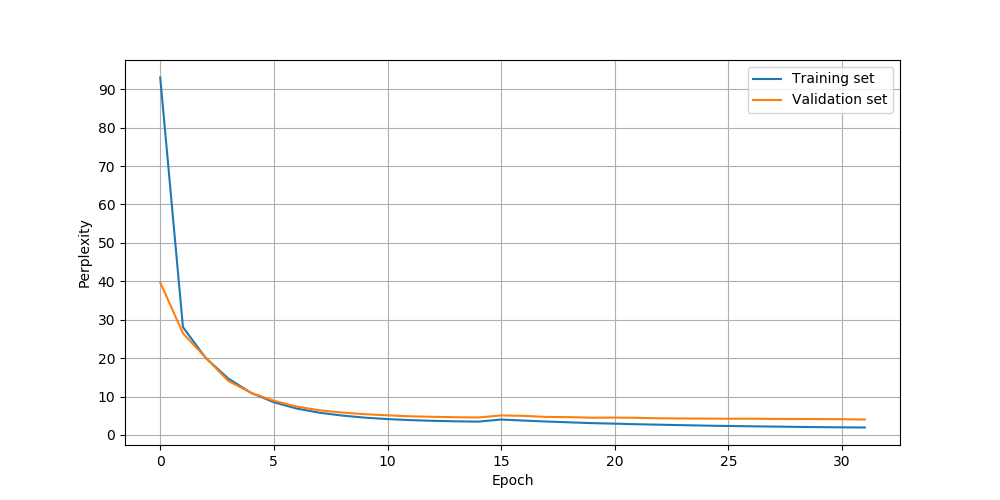
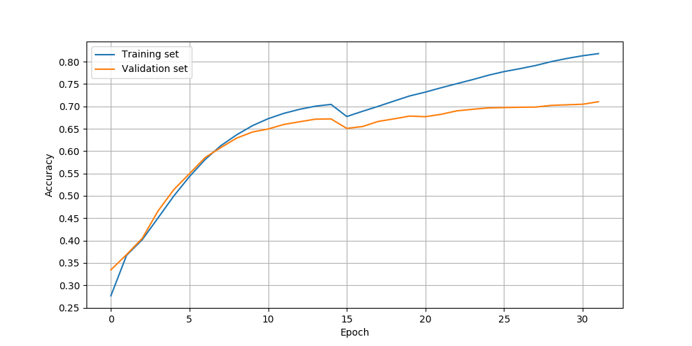
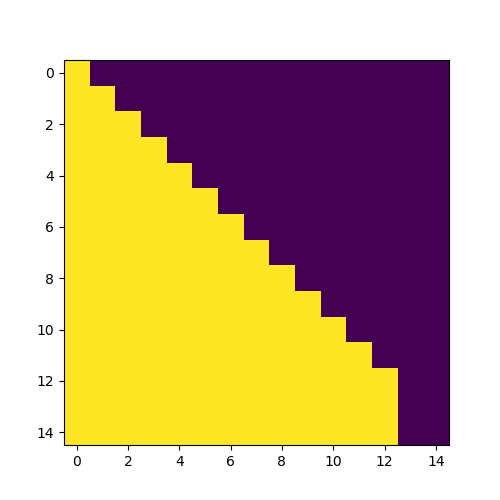
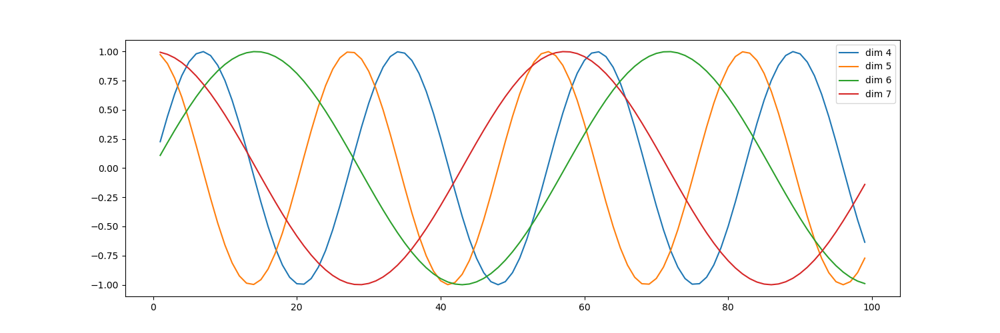

# transformer-keras

使用 Keras 和 tensorflow 实现的Transformer模型。

[Attention is All You Need](https://arxiv.org/abs/1706.03762)" (Ashish Vaswani, Noam Shazeer, Niki Parmar, Jakob Uszkoreit, Llion Jones, Aidan N. Gomez, Lukasz Kaiser, Illia Polosukhin, arxiv, 2017)

## 使用

以下以英德翻译任务为例：

### 数据预处理

```sh
examples/data_process.py
```

这将会把原始分离的英语句子和德语句子进行组装，生成下面的文件： 
- `data/en2de.s2s.txt`
- `data/en2de.s2s.valid.txt` 

数据来源：WMT'16 Multimodal Translation: Multi30k (de-en) (http://www.statmt.org/wmt16/multimodal-task.html).

### 生成字典
   
```sh
examples/tokenizer_test.py
```

这会生成以下的字典文件：

- `data/dict_en.json`
- `data/dict_de.json`

**注意**：默认生成的字典过滤掉了词频数小于5的词语，你可以进行修改。

### 训练
   
```sh
examples/train_test.py
```

训练参数和配置可在文件 `train_test.py` 中找到, 默认模型配置如下：

```json
{
        "src_vocab_size": 3321,
        "tgt_vocab_size": 3638,
        "model_dim": 512,
        "src_max_len": 70,
        "tgt_max_len": 70,
        "num_layers": 2,
        "num_heads": 8,
        "ffn_dim": 512,
        "dropout": 0.1
}
```

### 解码/翻译
   
你可以使用以下方式进行解码:
1. `beam_search_text_decode`
2. `decode_text_fast` 
3. `decode_text`

详情见： `examples/decode_test.py`. 

## 性能

性能测试时模型使用的配置与默认配置相同

### 训练时性能

数据集包括 29000 个训练样例, 1014 个验证样例。

| gpu    | batch_size | time (s / per epoch) |
| ------ | ---------- | -------------------- |
| 1070Ti | 64         | 38                   |

### 解码/翻译性能


| method                  | topk | mean time (ms) | max time (ms) |
| ----------------------- | ---- | -------------- | ------------- |
| beam_search_text_decode | 5    | 210.135        | 1061.358      |
| decode_text             | /    | 90.555         | 309.771       |
| decode_text_fast        | /    | 56.446         | 266.988       |

**注意**：最大耗时一般只发生在模型未训练时，即使用一个完全未训练的模型进行解码。


## 效果

### 训练效果

以下为使用SGDR作为学习率变化策略，迭代32次的训练效果图：

<div>
    
    
</div>

由于数据集很小，通过缩小模型规模，应该能得到更高的精确度（如，设置model_dim=256）。

### 解码效果


1. 直接解码`decode_text_fast`

    | 源句子                                                               | 目标句子                                                                 | 解码句子                                                            |
    | -------------------------------------------------------------------- | ------------------------------------------------------------------------ | ------------------------------------------------------------------- |
    | A brunette woman is standing on the sidewalk looking down the road . | Eine brünette Frau steht auf dem Gehweg und blickt die Straße hinunter . | eine brünette frau steht auf dem gehweg und blickt auf die straße . |
    | A group of three friends are conversing inside of a home .           | Eine Gruppe von drei Freunden unterhält sich in einem Haus .             | eine gruppe von drei freunden unterhält sich in einem haus .        |
    | Two chinese people are standing by a chalkboard .                    | Zwei Chinesen stehen an einer Wandtafel .                                | zwei &lt;UNK&gt; personen stehen an einer tafel .                   |

2. 束搜索`beam_search_text_decode`

    源句子如下：
    ```python
    "Two women wearing red and a man coming out of a port @-@ a @-@ potty ."
    ```

    符号`@-@`表示这是一个连接左右两词的连接符，即`port @-@ a @-@ potty`是一个词`port-a-potty`。这么做只是为了方便训练。

    目标句子如下：

    ```python
    "Zwei Frauen in Rot und ein Mann , der aus einer transportablen Toilette kommt ."
    ```

    以束宽3经束搜索后的结果如下：

    | sentence                                                                          | score |
    | --------------------------------------------------------------------------------- | ----- |
    | zwei frauen die rot und ein mann verlassen eines &lt;UNK> .                       | 0.771 |
    | zwei frauen , die rot und ein mann kommen , verlassen aus einem &lt;UNK> .        | 0.742 |
    | zwei frauen , die rot und ein mann verlassen ist , verlassen aus einem &lt;UNK> . | 0.732 |

## Bleu跑分

待续。。。

## 其它

### 掩码可视化

```python
example/mask_test.py
```



### 位置编码可视化

```python
example/position_encoding_test.py
```



## 参考

1. [https://github.com/Lsdefine/attention-is-all-you-need-keras](https://github.com/Lsdefine/attention-is-all-you-need-keras)
2. [Transformer 模型的 PyTorch 实现](https://juejin.im/post/5b9f1af0e51d450e425eb32d)
3. [https://www.jiqizhixin.com/articles/Synced-github-implement-project-machine-translation-by-transformer](https://www.jiqizhixin.com/articles/Synced-github-implement-project-machine-translation-by-transformer)
4. [Setting the learning rate of your neural network](https://www.jeremyjordan.me/nn-learning-rate/)